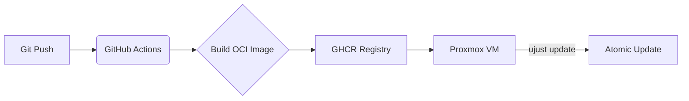

# ☁️ Cloud Native Gaming & Development Rig

[](https://github.com/<your-username>/<your-repo>/actions/workflows/build.yml)
[](https://blue-build.org/)
[-blue)](https://getaurora.dev/)

> **An immutable, declarative, and atomic workstation managed via GitOps.**
> *Designed for high-performance headless cloud gaming and development.*

## 📖 About
This repository contains the source code for my personal operating system image. The goal is to treat the workstation as **Immutable Infrastructure**.

The system is built automatically via GitHub Actions as an OCI container (Docker image), signed, and pushed to a registry. My cloud VM pulls updates in the background and applies them atomically upon the next reboot.

No configuration drift. No manual patching. If something breaks? `rpm-ostree rollback`.

**Scope:** This repository specifically targets my **Virtual Machine (Cloud Rig)**. Physical thin clients will be managed in a separate repository.

## 🏗 Architecture & Tech Stack



* **Base OS:** [Aurora DX](https://getaurora.dev/) (Fedora Silverblue/Atomic fork with KDE Plasma).
* **Build System:** [BlueBuild](https://blue-build.org/).
* **Gaming:** Nvidia Drivers (baked in), Steam (Flatpak), Sunshine (Headless Host).
* **Development:** VS Code, Podman, Distrobox (for mutable dev environments).
* **Configuration:**
* **OS Level:** `recipe.yml` & `files/` (System-wide configs).
* **User Level:** [Chezmoi](https://www.chezmoi.io/) (Dotfiles management).


## 🎮 Headless Cloud Setup

This image is optimized to run on a **Proxmox Virtual Machine** with PCI-E GPU Passthrough.

* **GPU:** Nvidia RTX 3070 (Passed through to VM).
* **Streaming:** [Sunshine](https://github.com/LizardByte/Sunshine) acts as the low-latency host server.
* **Client Access:** Accessed via [Moonlight](https://moonlight-stream.org/) from physical thin clients (laptop, TV, mobile).
* **Display Handling:** Uses a Dummy Plug (or virtual display driver) to force high-resolution rendering without a physical monitor attached.

## 🚀 Key Features

### ✅ Immutable & Atomic

The root filesystem (`/usr`) is read-only. All system changes are defined in this git repository. Updates are transactional—they either succeed completely or not at all.

### 📦 Container-First Workflow

Development environments are strictly separated from the host OS.

* **Distrobox:** Used to spin up mutable environments (Arch, Ubuntu, Fedora) for compilation and tooling.
* **Flatpak:** All GUI applications (Steam, Discord, Browsers) run in sandboxed containers.

### 🛠 Zero-Touch Reproducibility

From an empty disk to a fully functional gaming rig:

1. **PXE Boot/ISO:** Install the base image.
2. **Rebase:** The system connects to `ghcr.io/<user>/<repo>`.
3. **Chezmoi:** `chezmoi init --apply` pulls user configurations and scripts.
4. **Done.**

## 📂 Repository Structure

```text
├── recipe.yml           # "The Source of Truth". Defines packages and modules.
├── files/               # Files copied directly to root / (e.g., /etc/X11/...)
│   ├── system/
│   │   ├── etc/
│   │   │   ├── sddm.conf.d/  # Auto-login configuration
│   │   │   └── X11/          # Xorg configurations for headless/Nvidia
├── .github/workflows/   # CI/CD pipelines for building the OCI image.
└── README.md
```

## 🚧 Status & Known Issues

* **Session Type:** Currently utilizing **X11** instead of Wayland to ensure stability and correct cursor rendering during headless Nvidia streaming.
* **Nvidia:** Proprietary drivers are pre-installed in the image to support GPU passthrough out of the box.

## 🛠 Installation / Forking

To build your own version:

1. Fork this repository.
2. Edit `recipe.yml` to suit your needs.
3. Enable GitHub Actions.
4. Wait for the build to finish.
5. Install Aurora/Fedora Atomic and run:
```bash
rpm-ostree rebase ostree-unverified-registry:ghcr.io/<your-username>/<your-image-name>:latest
```

---

<div align="center">
<sub>Built with ❤️ and YAML by Daniel Vollbro.</sub>
</div>